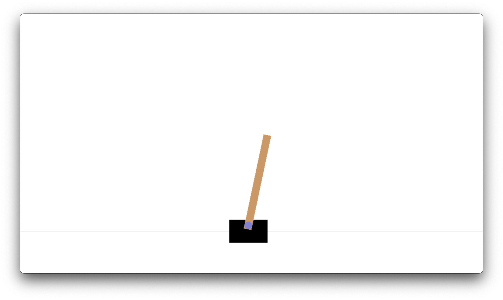
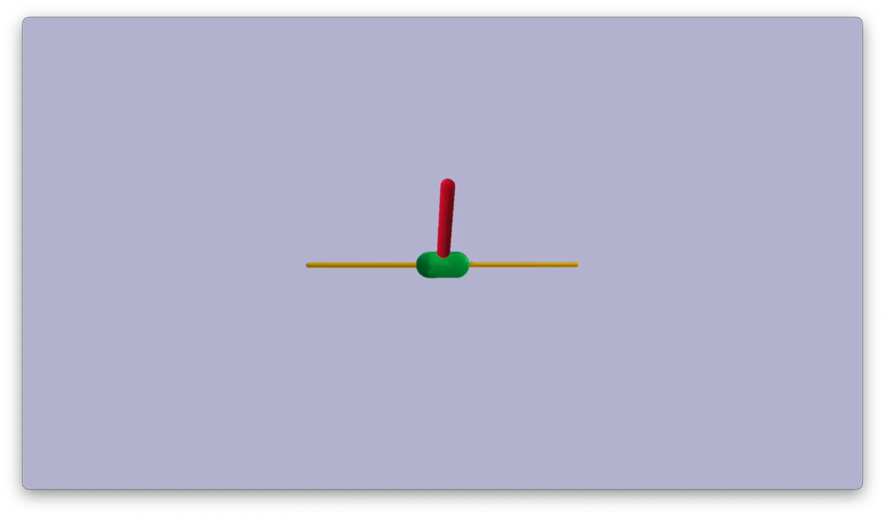
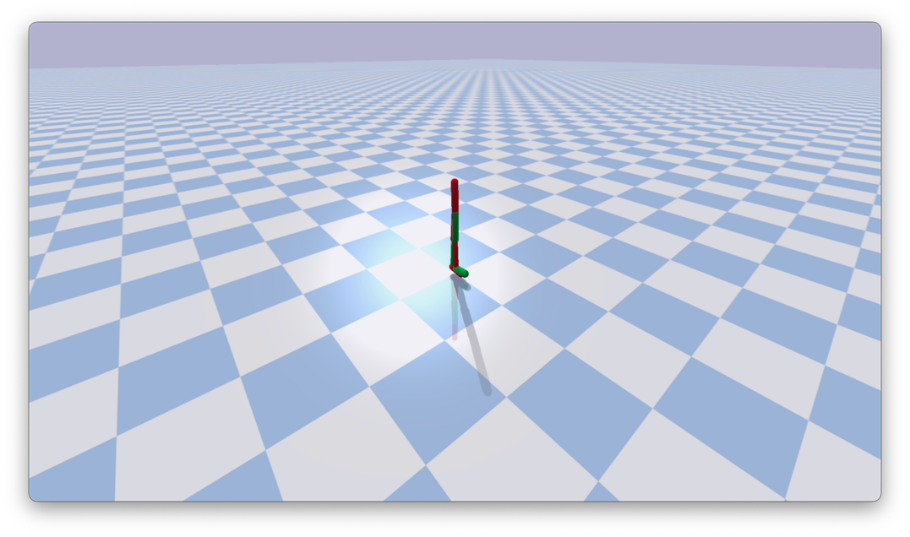
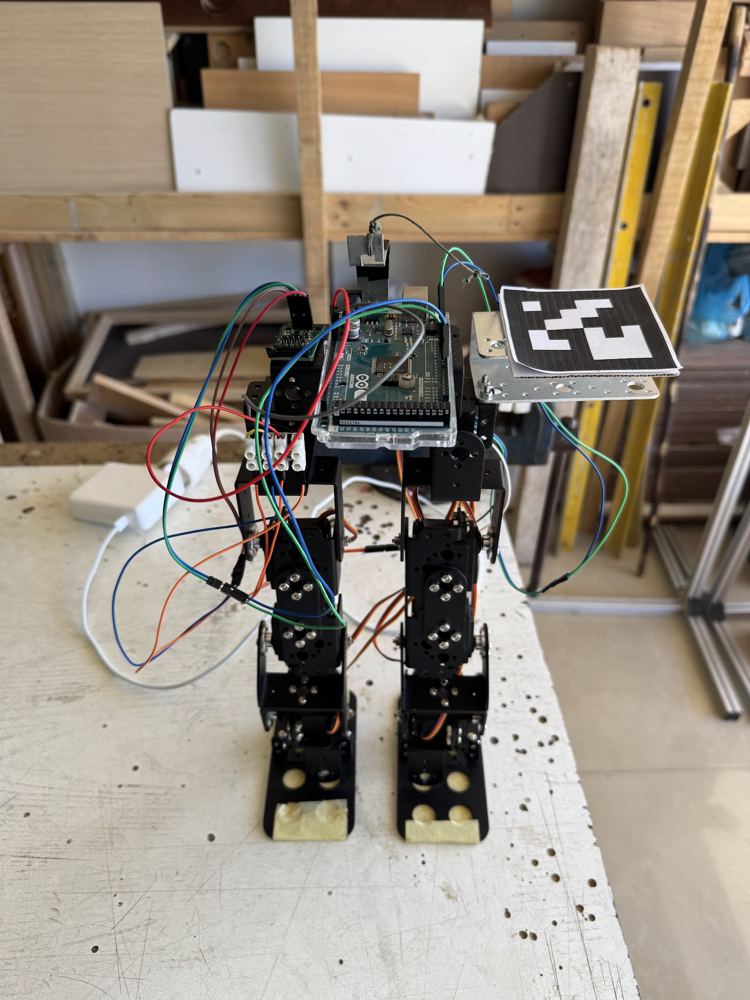

# Autonomous-Walking-via-RL
This project focuses on the development of autonomous walking capabilities for a biped robot using 
Reinforcement Learning (RL). It's a research thesis dedicated to exploring RL-based solutions 
for locomotion control.
## Inverted Pendulum
At first in order to evaluate the performance of the simple actor-critic algorithm and the soft
actor-critic algorithm, the inverted pendulum environment was used.
### Description

The inverted pendulum is a classic problem in dynamics and control theory.
The goal is to balance a pendulum on a cart that can move along a frictionless track.
### Results
Both the algorithms managed to solve the problem. The simple actor-critic algorithm took around
1000 episodes to solve the problem, while the soft actor-critic algorithm took around 200 episodes thus
proving to be actually more efficient. The visual results for both algorithms can be found in the 
<strong>videos</strong> directory.

## Bipedal Walker
Afterward, the bipedal walker environment was used because the goal is to develop a walking gait
for a real bipedal robot. This environment is more complex than the inverted pendulum one and is a
more realistic representation of the problem.
### Description

The bipedal walker is a 2D environment where a bipedal robot has to walk on a flat terrain. The
robot has two legs and each leg has two joints. The robot can move forward by applying torque to
the joints. The robot is rewarded for moving forward or standing up and penalized for falling down.
### Results
The only method used to solve the problem was the soft actor-critic algorithm. The self implemented algorithm was
able to keep the robot standing. The algorithm didn't manage to make the robot start walking. The
reason for this is that the algorithm didn't go through fine-tuning and perhaps there should be more
episodes in order to solve the problem. Furthermore, this proved that the soft actor-critic algorithm
is very sensitive to the hyperparameters and especially the temperature parameter (trade-off between
exploration and exploitation). Thus, for the next step, the algorithm will be  modified in order to 
automatically tune the temperature parameter. When using the SB3 implementation of the soft actor-critic algorithm, the robot
managed to learn a walking gait which made it a good solution for the next step of the project (real robot implementation).
The visual results of the algorithm can be found in the 
<strong>videos</strong> directory.

## Real Robot Implementation
The final step of the project is to implement the developed algorithm on a real bipedal robot. The robot that was used was a 6 DOF bipedal robot. It has two legs with three joints each (hip, knee, and ankle). The robot is equipped with an Arduino MEGA and was controlled with python scripts via serial communication.

To assist the learning process, a stading assistive mechanism was used. The mechanism consists of a support structure that holds the robot upright while allowing it to move its legs freely. This setup helps prevent falls during the initial learning phase minimizing the risk of damage to the robot and almost automzing the learning process since there no need for big readjustments after each fall.

Additionally, attached to the mechanism was a weight sensor that provided an addtional metric that was used to evaluate the performance of the algorithm. The weight sensor measured the amount of weight supported by the robot, which is an indicator of how well the robot is balancing itself.

As it can be seen from the images above, an ArUco marker was attached to the robot in order to track its position and orientation using a camera. This setup allowed for real-time feedback on the robot's movements, which was crucial for the learning process.

### Results
Unfortunately, the algorithm didn't manage to make the robot walk. However, the robot was able to stand and make small movements with its legs but it couldn't achieve a full walking gait. The problem lies mainly in the equipment used. The Arduino MEGA was limiting the process since after aproximately 1500 steps it would lock the motors in a fixed position and the experiment would need to be reseted. Having this issue there process had to be segmented and the learning couldn't be continuous making it harder for the algorithm to learn. The issue was proved that it was caused by the Arduino since before a smaller Arduino UNO was used and the same problem appeared but after aproximately 500 steps. The Arduino MEGA improved the situation but it wasn't enough.

For future work, a more powerful microcontroller should be used in order to allow for longer continuous learning sessions. Since the SB3 implementation of the soft actor-critic algorithm managed to make the simulated robot walk, there are high chances that with a better setup the real robot will also manage to walk.